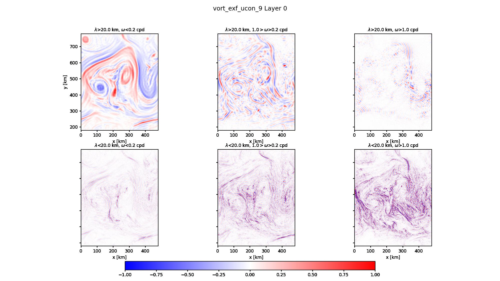
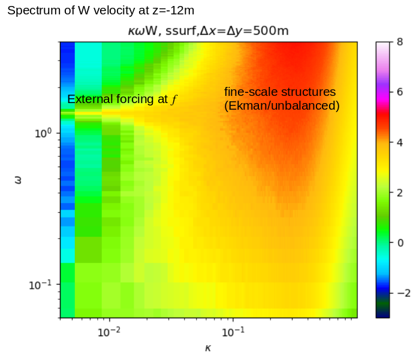
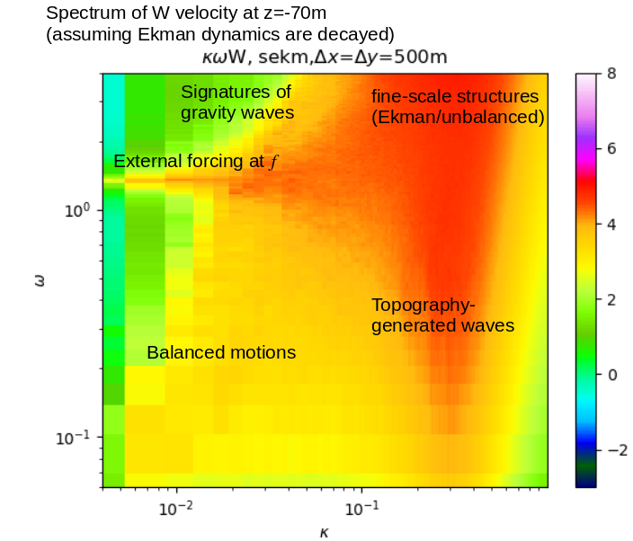
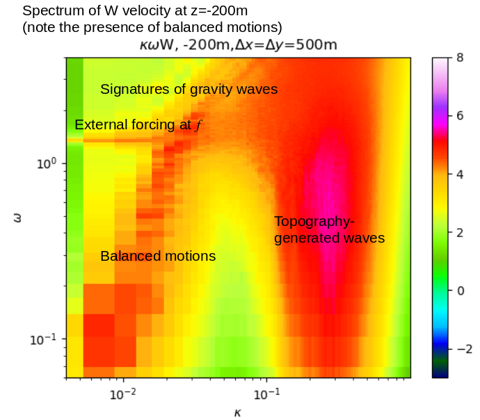
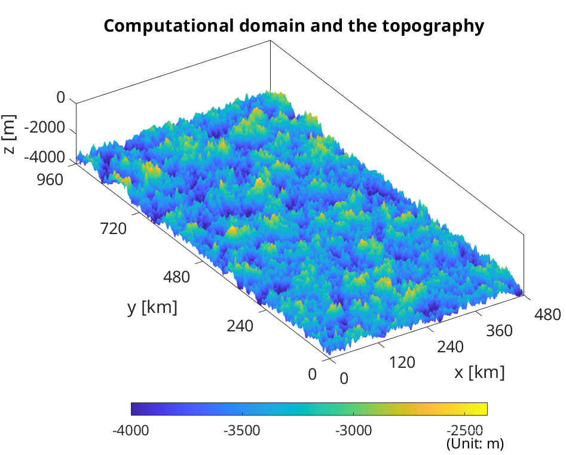
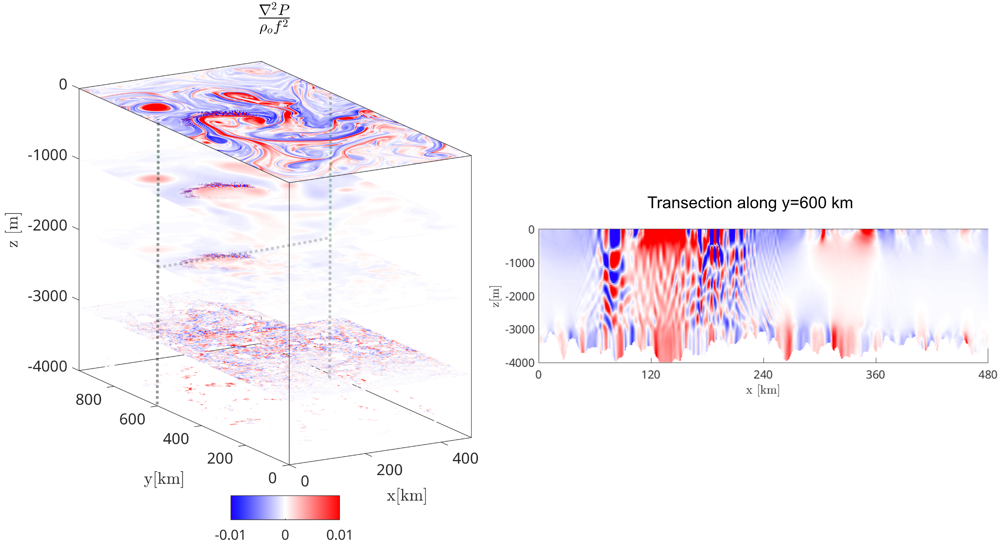

# PS_MITgcm
Postprocessing on MITgcm results
(Update July 16, 2021)

## Table of content
- [PS_MITgcm](#ps-mitgcm)
  * [PYTHON SECTION](#python-section)
    + [Features](#features)
      - [Example of frequency filtering](#example-of-frequency-filtering)
      - [Example 1](#example-1)
          + [Example of results:](#example-of-results-)
  * [MATLAB SECTION (deprecated)](#matlab-section--deprecated-)


## PYTHON SECTION

To import module for post-processing data, call:
```
import PPFCN.ppfcn as ppf
```
Additionally, for FFT-related processing, use:
```
import PPFCN.fftfcn as fcn
```
Both modules are dependent on Numpy and PyTorch (as well as torch.fft), which are imported when calling PPFCN functiom by calling (**necessary**):
```
from PPFCN import *
```


Used for reading files from direct outputs, diagnostics, and extracted binary file.

**Directory name**: `./py_process/`
**Directory structure**:
1. Individual code:  `./py_process/code/` 
2. Module: `./py_process/code/ppmod/PPFCN/`
3. Cases: `./py_process/cases/`


### Features
1. Instantaneous fields 
   - [x] Reading Diagnostics files (using MITgcm's `MITgcmutils.rdmds()`)
   - [x] Reorganizing diagnostics file and store them based on the location of vertical layers (meta data object: `$HOME/postproc/results/saved_obj/`, tensors used for PyTorch: `$HOME/postproc/results/layered_ts/` 
   - [x] Plotting instantaneous fields (U, V, W, SSH, T, rel. vorticity, Lap(lap(SSH)), etc., saved in `$HOME/postproc/img/` )
   - [x] Output instantaneous into movie files 
   - [x] Storing fields in tensor (for `PyTorch`)
ppfcns


2. Spectral analysis
   - [x] Wave-number/frequency spectra on any horizontal fields
   - [x] Rotary spectra given 2-D time series of U and V
   - [x] Fourier filters on given frequency windows
   - [x] Fourier filters on given spatial resolution windows

#### Example of frequency filtering

Below shows the model output of relative vorticity at surface given different frequency and spatial wavenumber filtering windows. 
(`/py_process/code/plot_fltd_freq_subplot.py`)

</img>

Similarly, the difference between model output and inferred field by geostrophic model (SSH or pressure based) can be plotted in the same manner.


#### Example 1 

1. Extract Diagnostic files

Code for reorganize Diagnostics MDS files:

**Executable shell script**
`./py_process/sh_script/run_load_diagnostics.sh`

In this file, edit the desired parameters and case information:

For example,
```
dx=500
dy=500
Lx=480000
Ly=960000
ind_z=1,2,3,4,5,20,60
fhead='Diag_snaps_UV'
path_scratch=$HOME/scratch/MITgcm_cases/
path_results=$HOME/postproc/results/
groupname=''
casename="rel_uvar_9"
start_ind=700000
end_ind=734421

tape_days=7
Fs=8
dt_model=75
z_target=1
```
in
| Parameter  | input | Notes |
| ------------- | ------------- | ------------- |
| dx  | 500  | zonal resolution |
| dy  | 500  | meridional resolution |
| Lx  | 480000  | zonal dimension |
| Ly  | 960000  | zonal dimension |
| ind_z  | 1,2,3,4,5,20,60  | index of vertical layers stored in Diagnostics file (see data.diagnostics) |
| fhead  | 'Diag_snaps_UV'  | (string with quotation marks) File head of specific diagnostics file, can be changed later for the desired field |
| path_scratch  | $HOME/scratch/MITgcm_cases/  | where raw case is stored |
| path_results  | $HOME/postproc/results/  | where extracted results will be stored |
| groupname  | ''  | (string with quotation marks) group name (parent directory of cases) |
| casename  | 'rel_uvar_9'  | (string with quotation marks) case name (directory name) |
| start_ind  | 700000  | the lower limit for searching file index |
| end_ind  | 734421  | the upper limit for searching file index |
| tape_days  | 7  | how many days one saved file contains (1.2 GB for one field for 7 days with dx=dy=500m) |
| Fs  | 8  | sampling rate of diagnostics file (Fs=8 <==> getting samples every 14400s)|
| dt_model  | 75  | timestep size in MITgcm model |
| z_target  | 0,1,4,5  | (dummy currently) desired vertical layer to store tensors |
| name_fields  | 'Uvel','Vvel'  | name of each field extracted |


**Executable shell script**

`./py_process/sh_script/run_load_diagnostics.sh`


Then, run `$HOME/MITgcm_post/py_process/code/read_save_3D_Diag_cls.py` with flags of parameters 
name_fields='Uvel','Vvel'
```
python $HOME/MITgcm_post/py_process/code/read_save_3D_Diag_cls.py --dx=$dx --dy=$dy\
      --Lx=$Lx --Ly=$Ly --ind_z=$ind_z --fhead=$fhead --path_scratch=$path_scratch\
      --path_results=$path_results --groupname=$groupname  --casename=$casename\
      --start_ind=$start_ind --end_ind=$end_ind --tape_days=$tape_days --Fs=$Fs\
      --dt_model=$dt_model --z_target=$z_target --name_fields=$name_fields
```
This will generate two groups of files.

The name, data structures, and paths of raw MDS files, tensors, and results will be stored in `$HOME/postproc/results/saved_obj/`, indicated by the group name and case name. Loading these files requires import the `pickle` package in Python.

Tensors of each extracted field will be stored at `$HOME/postproc/results/layered_ts/`, which will be loaded using PyTorch `.load()` function.

2. Plotting instantaneous filed or spectral analysis results

Using the same script, simply call the script `$HOME/MITgcm_post/py_process/code/load_3D_Diag_plot_kw.py` with the same parameters. For example,
```
python $HOME/MITgcm_post/py_process/code/load_3D_Diag_plot_kw.py --dx=$dx --dy=$dy\
        --Lx=$Lx --Ly=$Ly --path_scratch=$path_scratch --path_results=$path_results\
        --groupname=$groupname  --casename=$casename --start_ind=$start_ind --end_ind=$end_ind\
        --tape_days=$tape_days --Fs=$Fs --dt_model=$dt_model --z_target=$z_target --name_fields=$name_fields
```
Images will be stored at `$HOME/postproc/img/`.

**A separate plotting shell script is given too**
`./py_process/sh_script/run_plotting.sh`

###### Example of results: 
Direct output of wavenumber-frequency spectra of W (vertical velocity, m/s) at -12m (one grid below the surface), -70m, and -200m.

Annotations are added later manually.

</img>
</img>
</img>


## MATLAB SECTION (deprecated) 
Currently, it is used to extract slides from output files generated by the Diagnostics package

**Code location:**
`./code/`

**Cases location:**
`./cases/`

**Sample results coming from MATLAB section**
1. Toography and vertical stretching
</img>
2. Plotting on a 3D perspective showing vertically propagated waves generated by topography
</img>

